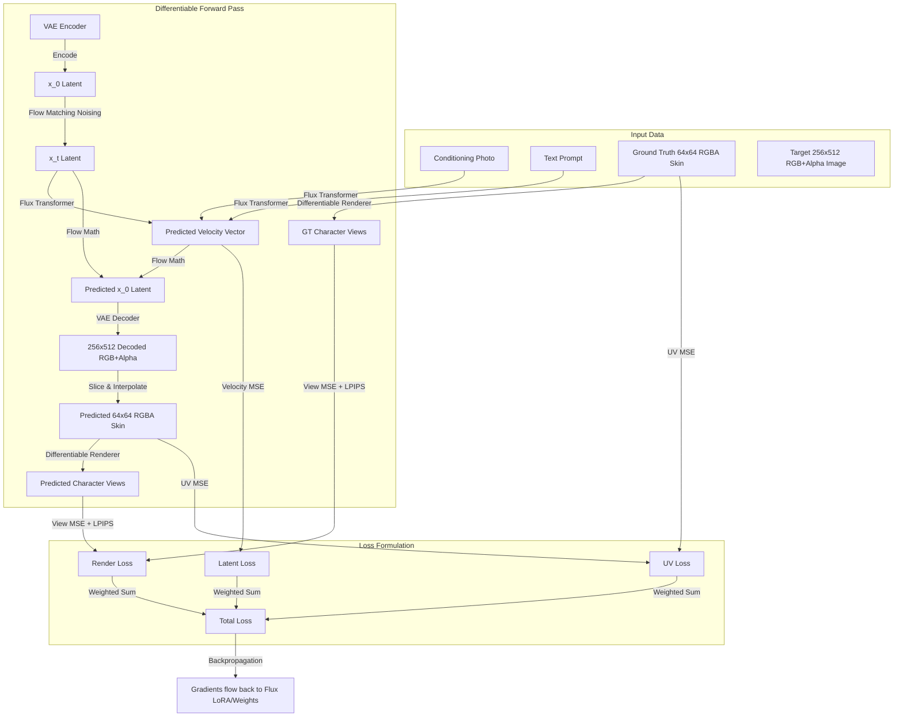

# SkingToolkit: Flux2Klein Differentiable Training Framework

`SkingToolkit` is a custom fine-tuning and training framework for **Flux2Klein** Minecraft Skin Generator models. It integrates a **Differentiable Renderer** directly into the PyTorch training pipeline, allowing gradients from rendering losses (visual differences on 3D characters) to flow backwards through the VAE and optimize the Flux model's weights.

---

## 🚀 Key Features

* **🎨 Differentiable Rendering Backpropagation**: Uses PyTorch `F.grid_sample` to warp the flat predicted `64x64` skin texture maps into multi-view 2D renders (such as `static_front` and `static_back`). The entire rendering operation is mathematically differentiable, enabling rendering losses to guide the texture generation.
* **📐 Top-to-Bottom Target VAE Layout `[RGB | Alpha]`**: Resolves the VAE's native 3-channel (RGB) limitation by packing the target `64x64` RGBA skin into a `256x512` RGB canvas:
  - **Top half (`256x256`)**: Skin UV RGB upscaled via Box filtering.
  - **Bottom half (`256x256`)**: Skin UV Alpha upscaled via Box filtering and represented as grayscale.
  - Gradients flow back smoothly through both active regions during training with no empty padding.
* **🖼️ Multi-View Control Image Loader**: Supports loading conditioning input as separate front and back views (each $256 \times 512$, e.g., from `front/` and `back/` directories). It automatically resizes and concatenates them side-by-side to construct a standard $512 \times 512$ conditioning input, with fallback to pre-combined files.
* **🎮 Voxel Texture Edge Consistency Resolver**: Reconstructs a temporary 3D voxel color grid during loading to resolve missing/transparent pixel conflicts at adjacent edges.
* **🔄 Slim-to-Standard Arm Expansion (Alex-to-Steve)**: Dynamically checks and converts Alex skins (3px arm width) into Steve skins (4px arm width) before training.
* **💾 Extreme VRAM Optimization**: Pre-encodes all text prompts into memory and completely unloads the Text Encoder(s) before the training loop starts. This saves massive amounts of VRAM (up to 8GB for models like Qwen-4B), freeing up space for larger batch sizes or differentiable rendering overhead.
* **👁️ Perceptual LPIPS Loss**: Supports optional LPIPS rendering loss to retain sharp pixel textures. Automatically enables when `--lambda_lpips` > 0.
* **🤖 Dual Architecture Compatibility**:
  - **Standard Flux**: Supports vanilla Hugging Face `diffusers` pipelines (T5 + CLIP text encoders, `FluxTransformer2DModel`).
  - **Flux2Klein (Custom)**: Supports custom sequence packing (`batched_prc_img`, `batched_prc_txt`), output scattering (`scatter_ids`), Qwen-based text encoders (hidden layer stacking of `[9, 18, 27]`), and custom VAE structures (small decoders).

---

## 📂 File Directory

```bash
SkingToolkit/
├── README.md              # Technical documentation & guide
├── renderer.py            # Common Differentiable Renderer using PyTorch grid mapping
├── img2skin/              # Subproject 1: Flux2/Klein model & fine-tuning
│   ├── flux2_src/         # Custom Flux2/Klein model modules
│   ├── dataset.py         # MinecraftSkinDataset wrapper for Flux2 target packing
│   ├── loss.py            # MinecraftLoss combines UV and multi-view MSE/LPIPS
│   ├── train.py           # Differentiable fine-tuning script
│   ├── export_debug_target.py # Debug tool for target canvas outputs
│   ├── test_toolkit_setup.py  # Local mathematical setup verification test
│   └── run_img2skin_training.sh # Shell launcher for img2skin fine-tuning
├── inverse_uv/            # Subproject 2: Supervised fixed-view render -> 64x64 UV training
│   ├── dataset.py
│   ├── model.py
│   ├── losses.py
│   ├── train.py
│   ├── infer.py
│   ├── run_inverse_uv_training.sh # Shell launcher for inverse_uv training
│   └── run_inverse_uv_infer.sh    # Test inference script for inverse_uv
└── foreground_alpha/      # Subproject 3: Foreground alpha extraction training utilities
    ├── dataset.py
    ├── model.py
    ├── train.py
    ├── infer.py
    ├── run_foreground_alpha_training.sh # Shell launcher for foreground_alpha training
    └── run_foreground_alpha_infer.sh   # Inference script for foreground_alpha
```

## 🧩 Subproject Deep Dive

SkingToolkit houses three main subprojects, each designed for a specific part of the Minecraft skin generation and reconstruction lifecycle:

### 1. 🎨 `img2skin` (Flux2/Klein Model Fine-Tuning)
This subproject is the core of the toolkit. It fine-tunes the **Flux2Klein** Minecraft Skin Generator model by linking it directly with a 3D Differentiable Renderer.

* **Key Concept**: Gradients from visual rendering differences (e.g., comparing 3D character views of the generated skin vs ground truth) flow backwards through the VAE decoder directly into the Flux model weights.
* **Core Workflow**:
  1. Caches prompt text embeddings from system memory and unloads Qwen text encoders to save ~8GB VRAM.
  2. Runs Phase 1 (Latent Warmup) optimizing Flow Matching Latent MSE.
  3. Runs Phase 2 (Differentiable Rendering) to decode estimated latents to RGBA skin textures, render 3D views, and calculate foreground-weighted pixel MSE + LPIPS losses.
* **How to Run**:
  * **Test Setup**: `python SkingToolkit/img2skin/test_toolkit_setup.py` (runs mock setup and fits a learnable skin in 10 steps).
  * **Train**: `bash SkingToolkit/img2skin/run_img2skin_training.sh`

---

### 2. 📐 `inverse_uv` (Supervised Render-to-UV Reconstruction)
A supervised deep learning pipeline designed to map 2D multi-view renders back into flat `64x64` RGBA Minecraft skin layouts.

* **Key Concept**: Instead of forcing the model to learn long-distance pixel translation from 2D images to 64x64 flat sheets, it uses Differentiable Renderer camera coordinates to **unproject** the renders into an aligned UV canvas. A U-Net then fills/inpaints the unprojected UV canvas to output the clean skin texture.
* **Core Workflow**:
  1. Unprojects views into a unified UV canvas.
  2. Feeds unprojected inputs into a supervised `InverseUVNet` architecture.
  3. Minimizes visible RGB reconstruction loss, alpha reconstruction loss, and UV-space edge alignment losses.
* **How to Run**:
  * **Train**: `python SkingToolkit/inverse_uv/train.py --data_dir /path/to/skins --output_dir runs/inverse_uv_run` (or launch via `bash SkingToolkit/inverse_uv/run_inverse_uv_training.sh`).
  * **Inference**: `bash SkingToolkit/inverse_uv/run_inverse_uv_infer.sh`

---

### 3. 🖼️ `foreground_alpha` (RGB to RGBA Foreground Alpha Extraction)
A specialized segmentation network to isolate character pixels from production backgrounds.

* **Key Concept**: Converts standard 3-channel RGB Minecraft renders (with solid backgrounds) into clean 4-channel RGBA renders by predicting the foreground alpha mask. This is critical for `inverse_uv` to reconstruct clean skins from renders with solid backgrounds.
* **Core Workflow**:
  1. Composites character renders over random solid RGB backgrounds during training.
  2. Trains a `ForegroundAlphaNet` (U-Net style segmenter) using Binary Cross-Entropy (BCE), Dice, and L1 edge alignment losses.
  3. Predicts alpha masks and optionally runs "uncomposition" to recover clean anti-aliased edge RGB colors from the background.
* **How to Run**:
  * **Train**: `bash SkingToolkit/foreground_alpha/run_foreground_alpha_training.sh`
  * **Inference**: `bash SkingToolkit/foreground_alpha/run_foreground_alpha_infer.sh`

---

## 🛠️ Setup & Verification

Before running training, verify the installation, coordinate mappings, and gradient backpropagation math on your machine.

### 1. Requirements
Install necessary dependencies:
```bash
pip install torch torchvision diffusers transformers accelerate peft einops tqdm pillow numpy
```
*Note: To run perceptual losses, optionally install `lpips` (`pip install lpips`).*

### 2. Verify Setup
Run the self-contained setup test script to mathematically prove that gradients flow correctly through the VAE and Renderer back to the model:
```bash
python SkingToolkit/img2skin/test_toolkit_setup.py
```
This script will mock a small dataset batch, compile views, run a 10-step mock backpropagation fitting, and display the gradient norm.

---

## 🏋️ How to Train

Use [run_img2skin_training.sh](img2skin/run_img2skin_training.sh) to quickly configure parameters and launch training:
```bash
bash SkingToolkit/img2skin/run_img2skin_training.sh
```

### Script Configuration Parameters

| Parameter | Type | Default | Description |
| :--- | :--- | :--- | :--- |
| `--model_path` | string | *Required* | Path containing model weights/safetensors folder. |
| `--text_encoder_path` | string | `None` | Path to the Qwen model (defaults to `Qwen/Qwen3-4B`). |
| `--data_dir` | string | *Required* | Folder containing target flat `64x64` skin PNGs. |
| `--photos_dir` | string | `None` | Folder containing conditioning control photos. Looks for separate `front/{id}.png` and `back/{id}.png` (each 256x512) to combine side-by-side, otherwise falls back to `{id}.png` (512x512). |
| `--mappings_dir` | string | `None` | Folder containing the `.pt` view mapping coordinates. |
| `--output_dir` | string | `output` | Folder to save fine-tuned LoRA weights. |
| `--lora_target_modules` | string | `None` | Comma-separated target modules (e.g. `qkv,linear1,linear2,proj` for custom models). |
| `--lr` | float | `1e-4` | Learning rate. |
| `--batch_size` | int | `1` | Training batch size. |
| `--mixed_precision` | string | `bf16` | Precision mode (`bf16`, `fp16`, or `no`). |
| `--lambda_latent` | float | `1.0` | Coefficient weight of Flow Matching latent loss. |
| `--lambda_uv` | float | `1.0` | Coefficient weight of flat skin UV loss ($L_{uv}$). **Recommended: 10.0 - 20.0** |
| `--lambda_render` | float | `1.0` | Coefficient weight of rendering loss ($L_{render}$). **Recommended: 20.0 - 50.0** |
| `--lambda_lpips` | float | `0.0` | Coefficient weight of LPIPS rendering loss. Automatically activates LPIPS if `> 0`. **Recommended: 0.1 - 1.0** |
| `--views` | string | `static_front,static_back` | Views to include in the render loss. |
| `--foreground_weight` | float | `1.0` | Focus multiplier weight on foreground character pixels. |

---

## 💡 Training Tips & Loss Scaling

Because **Latent MSE** is calculated on flow-matching noise velocities (which have a large variance and magnitude, e.g., ~0.1 - 0.5), while **UV/Render MSE** are calculated on normalized pixel arrays in `[0, 1]` (resulting in extremely small absolute squared errors like ~0.001), you must scale up the auxiliary losses significantly to make them affect the gradients.

* **Scale Up Lambdas:** We highly recommend setting `LAMBDA_UV=20.0` and `LAMBDA_RENDER=50.0` in your `run_img2skin_training.sh` script to force the optimizer to respect the 3D structure.
* **Progress Bar Display:** The real-time progress bar logs display the **raw, unscaled** MSE values. Therefore, seeing `UV MSE=0.0008` during training is completely normal and healthy; the scaling multiplier is applied automatically in the backend gradients.
* **LPIPS for Texture:** Standard MSE loss often produces blurry or overly smooth textures. Setting `LAMBDA_LPIPS=0.5` significantly sharpens the pixel art grain and fabric folds.

---

## 🛤️ The Full Training Workflow Explained

Understanding the lifecycle of a training run helps in debugging and parameter tuning. Here is exactly what happens when you execute `run_img2skin_training.sh`:

### 1. Initialization & VRAM Purge
The dataset script initializes by scanning your `skins` folder. If it detects any 3-pixel arm (Alex) skins, it dynamically converts them to standard 4-pixel arm (Steve) format to ensure geometric consistency. 
Before the training loop even begins, the script pushes all unique text prompts through the massive Qwen Text Encoder. The resulting embeddings are cached in system RAM, and the Text Encoder is **permanently deleted from VRAM** (`del text_encoder`, `empty_cache()`), freeing up ~8GB of memory for the heavy rendering tasks ahead.

### 2. Phase 1: Latent Warmup (Speed & Structure)
For the first 200 epochs (configured via `RENDER_WARMUP_EPOCHS`), the training skips all pixel-space decoding and 3D rendering. It strictly optimizes the **Latent Flow Matching MSE** (predicting the velocity vector towards the noise-free latent). This allows the Flux LoRA to rapidly learn the basic spatial layout and structure of a Minecraft skin at extremely high speed.

### 3. Phase 2: Differentiable Rendering & Texture Tuning
Once the warmup epochs pass, the pipeline activates the auxiliary rendering losses. The process becomes highly complex:
1. The predicted latent velocity is used to estimate the clean latent $x_0$.
2. The $x_0$ latent is passed through the VAE Decoder to produce a $1024 \times 512$ RGB+Alpha canvas.
3. The top (RGB) and bottom (Alpha) halves are sliced, downsampled to $64 \times 64$, and concatenated into a standard RGBA Minecraft texture.
4. PyTorch's `F.grid_sample` warps this $64 \times 64$ texture onto a 3D character layout from multiple camera views (`static_front`, `static_back`).

### 4. Foreground-Focused Pixel & Perceptual Loss
The generated multi-view renders are compared against ground truth renders. To prevent the empty gray background from diluting the loss, the script computes a foreground mask and calculates **MSE strictly on the character's pixels**. Additionally, the **LPIPS perceptual loss** evaluates the sharpness and high-frequency details (like pixel art grain and fabric folds), sending powerful gradients all the way back through the renderer and VAE into the Flux LoRA weights.

### 5. Validation & Checkpointing
Every `VALIDATION_STEPS`, the model pauses training to sample images from pure noise using the Euler ODE solver (default 28 inference steps). It saves the visual samples and the updated LoRA safetensors to your `output_dir`.

---

## 🧬 Differentiable rendering workflow


