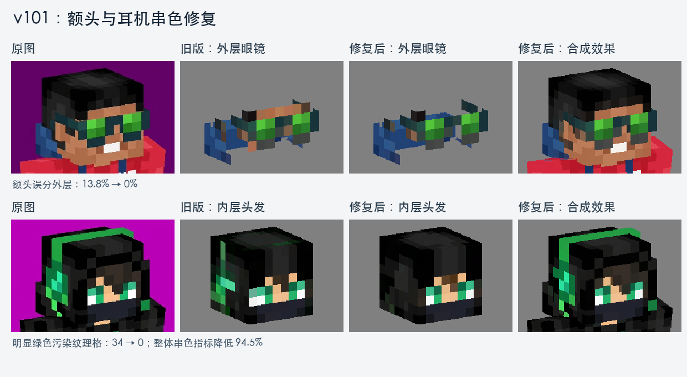

# v101 额头误分与耳机串色修复

已训练并验证新的头部语义分支。版本仍为 v101，原版权重、v100 分支和原始输出均保留。



## 两个案例的结果

| 检查项 | 原版 | 修复后 |
|---|---:|---:|
| 额头标注区误分外层 | 13.75% | 0% |
| 对应额头外层纹理格 alpha | 255 | 0 |
| 耳机样例内层明显绿色污染格 | 34 | 0 |
| 内层非面部绿色超额总量 | 9.5373 | 0.5216 |
| 帽沿四面连续格数 | 32/32 | 32/32 |
| 蓝色幽灵的紫色背景污染像素 | 0 | 0 |

绿色指标只用于这张耳机图的诊断，排除了绿色眼睛；推理没有使用“绿色属于耳机”这样的颜色规则。0.5216 表示仍有轻微色偏，不能据此宣称完全消除了所有串色。

整副眼镜的近似手工标注区外层覆盖率为 90.30% → 89.94%，下降 0.36 个百分点；语义精确率 89.77% → 89.98%。这一小幅边界取舍换来了额头误分的消除。此案例用于开发回归，没有放进训练，也不是独立测试集。

## 修复了什么

1. 原来的语义分支只有“无附件、眼镜、帽子、外层头发”，缺少明确的内层面部、内层头发和耳机监督。新增独立语义分支，训练 1,200 + 3,000 步；整副耳机存在性分支另训练 1,200 步。原 v101 的全部参数保持逐张量相等。
2. 额头的错误格子主要来自旧几何路由，来源像素平均眼镜概率仅约 3%。现在用学习得到的面部语义在最终纹理分辨率上处理冲突，避免少数边界像素保住一整块错误外层。
3. RGB 取样原本只避开人物与背景的边缘，没有避开内外层交界。现在剔除这类混色来源，并剔除与已确认外层附近耳机语义冲突的内层取色。
4. 补全使用可靠的已观测头发纹理修复被耳机遮挡的头发；不把眼睛或递归补出来的像素当作头发来源。
5. 颜色拟合按渲染器的实际可见层分别更新。缺乏可靠观测的内层纹理保持补全结果，避免重新吸收耳机颜色。

早期候选允许耳机分支直接新增外层，曾在卡通皮肤等样本上出现误识别，已否决。发布配置让该分支在已有可靠外层几何内校正取色，不开放任意新增耳机外层格子。这保留了本次修复，也限制了新耳机模型目前能承担的范围。

## 验证

- 14 张真实图片均完成原图、旧版、新版对照检查；身体 UV 与前景遮罩逐像素相同。
- 123 项单元及集成测试通过，覆盖路由、语义分支、材质拟合、补全来源与旧模型兼容性。
- 最终另取之前未用于调整的 64 个来源（原 test split 的 64:128），使用新的程序生成种子 59101111，比较同一批 128 视图：

| 独立对照指标 | 原版 | 修复后 |
|---|---:|---:|
| 附件精确率 | 98.908% | 99.055% |
| 附件召回率 | 99.778% | 99.778% |
| 完整物体比例 | 99.405% | 99.405% |
| 新增外层与存储层不一致比例 | 1.823% | 1.518% |
| 头部 RGB 平均绝对误差 | 0.011726 | 0.011429 |
| 帽带 RGB 平均绝对误差 | 0.017683 | 0.017456 |

“存储层不一致”是回归代理指标，不等于完整的语义误检率。早期调参使用过的 64 个来源已明确列为开发回归，未冒充最终独立测试。

## 使用与文件

服务器：`ds@192.168.0.111`，项目根目录：`/home/ds/llms/SkingToolkitDev`。

默认批量入口仍为：

```bash
cd /home/ds/llms/SkingToolkitDev
bash dense_uv_parser/batch_infer.sh --inputs /完整路径/输入图片.png
```

新结果：`/home/ds/llms/SkingToolkitDev/dense_uv_parser/output_history/v101_semantic_fix_20260906/`

- 眼镜：`TWRLRRTHQP2UV368_edited_f8cc7de9d522/parser_pred_uv_simple_inpainting.png`
- 耳机：`img27_a010dbdab262/parser_pred_uv_simple_inpainting.png`

发布权重：`/home/ds/llms/SkingToolkitDev/dense_uv_parser/runs/v101_semantic_release_gated_20260906/parser.pt`

解析器 SHA-256：`e5fa4a265e35bb4d514629ec94c9b2442b4718231b8cd841e6665f6e5b397c2d`

配套流程：`/home/ds/llms/SkingToolkitDev/dense_uv_parser/runs/v101_semantic_release_gated_20260906/pipeline.json`

去背景仍使用已验收的 `foreground_release_800/foreground_step_800.pt`。旧发布权重及输出没有覆盖；未通过的无限制耳机候选明确保存在 `output_history/v101_semantic_candidate_ungated_20260906`，不用于默认入口。

完整数值验收见 `regression/v101_semantic_fix_acceptance.json`；14 张图片的总览见 `real_review_1.png` 与 `real_review_2.png`。
