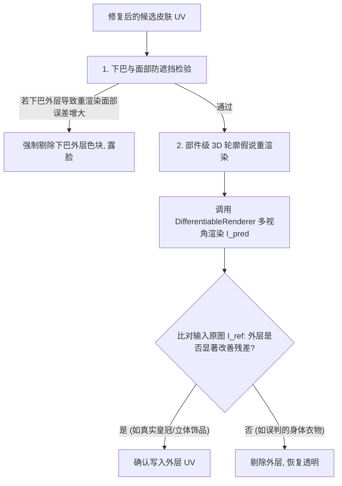

# 08 推理管线与路由

本章系统梳理生产推理链路：从输入 2D 视角渲染图到最终高保真 `pred_uv.png` 皮肤图集的完整流水线。
对应源码：`infer.py`、`foreground.py`、`utils.py`、`simple_inpainting.py`、`differentiable_hypothesis_refiner.py`、`inference_config.py`、`run_infer.sh`。

## 8.1 输入与前处理

```bash
COMBINED=/path/to/front_back.png ./run_infer.sh
```

1. **输入解析**：支持并排左右拼接图（`COMBINED`）或单独的多视角文件（`--front`、`--back`、`--view_images`）。
2. **前景分割（Flood Fill）**：
   - 以左上角背景色为种子进行四连通漫水填充（`estimate_top_left_flood_foreground`），提取精准角色前景，保留角色轮廓内部包围的空隙。
3. **自适应背景替换（Adaptive Background）**：
   - 自动选择与前景边缘色差最大的背景基底输入网络，防止背景色渗入边界。

## 8.2 网络前向与 3D UV 空间特征对齐

1. `DenseUVParserNet` 接收各视角图像与 one-hot 视图条件。
2. `UVMultiViewSpatialFusion` 将各视角 2D 卷积特征投影至 64×64 3D UV 空间，执行 360° 环绕跨视角交互，输出：
   - 逐像素路由角色（Inner / Outer / Secondary）及置信度；
   - 64×64 全局 3D UV 外层占有率先验。

## 8.3 中心加权众数取色（Center-Weighted Mode Splatting）

在 `splat_parser_predictions_to_uv_conditioning` 中：
- 拒绝简单像素均值（Mean Blending 容易冲淡高饱和度像素画原色并引入模糊）。
- 采用 **中心得分加权的 24-bit 众数统计（`_select_exact_mode_candidates`）**：
  - 对每个图集纹素，收集投影到该处的全部安全源像素。
  - 以每个像素离该 UV 纹素中心的距离得分（`texel_center_score`）作为投票权重。
  - 纯正的纹素中心像素大幅压倒反走样过渡像素，完美保留 1 像素级的锐利线条与微小文字。

## 8.4 极简内层确定性修复（simple_inpainting.py）

针对未完全覆盖的图集纹素，执行极简确定的内层保底：

1. **内层（Base Layer）盲区修复**：
   - **左右对称优先（Symmetry First）**：利用 `mirrored_texel` 直接从身体对称面复制对应颜色。
   - **同部位 2D 近邻兜底（Same-Part 2D Nearest Neighbor）**：若对称面亦被遮挡，直接在同部位已观测像素中取最近邻纯色。
   - **强制全不透明**：内层所有有效纹素的 Alpha 均置为 1.0。
2. **外层（Decor Layer）铁律**：
   - **零脑补、零扩散**：未被直接观测或无确凿证据的外层纹素，严格保持 **100% 纯净透明（Alpha = 0.0, RGB = 0.0）**。
   - 彻底废除任何外层图扩张与闭环填补，从源头杜绝脏色伪影。

## 8.5 可微渲染假说检验与裁决（differentiable_hypothesis_refiner.py）

为了彻底解决 2D 空间难以分辨的内外层物理歧义，系统在后处理最后阶段引入 **Analysis-by-Synthesis 假说裁决**：



1. **下巴防遮挡（`protect_chin_occlusion`）**：
   - 自动检测头部正面下方的外层色块。若移除该外层色块能降低重渲染面部误差，系统直接判定该色块为衣物穿透伪影，并置为完全透明，完美露出内层五官与下巴。
2. **多视角 3D 轮廓残差裁决**：
   - 逐部件进行“有/无外层”的可微渲染对比。
   - 只有能在 3D 物理投影与视差轮廓上真正提升重渲染匹配度的外层结构（如皇冠锯齿尖角），才会被保留。

## 8.6 核心推理参数速查

| 参数项 | 默认值 | 作用 |
| :--- | :--- | :--- |
| `outer_route_confidence_threshold` | `0.80` | 外层预测置信度门槛 |
| `outer_uv_min_source_pixels` | `4` | 外层纹素最少源像素数（保护单视角高频细节） |
| `outer_silhouette_min_pixels` | `1` | 外层微小突起最小像素数（保护皇冠尖角） |
| `hypothesis_render_refine` | `True` | 开启 Analysis-by-Synthesis 可微渲染假说裁决 |
| `protect_chin_occlusion` | `True` | 开启下巴/面部防遮挡物理裁决 |

## 本章要点

1. 洪水填充提取前景，自适应纯色替换背景。
2. 中心得分加权众数取色（`grid_mode`），保留 1 像素高频原色。
3. 极简内层盲区修复（对称 + 近邻），外层未观测严格透明。
4. 可微渲染假说检验（Analysis-by-Synthesis）作为物理终审，彻底根除遮挡面罩与假外层。
